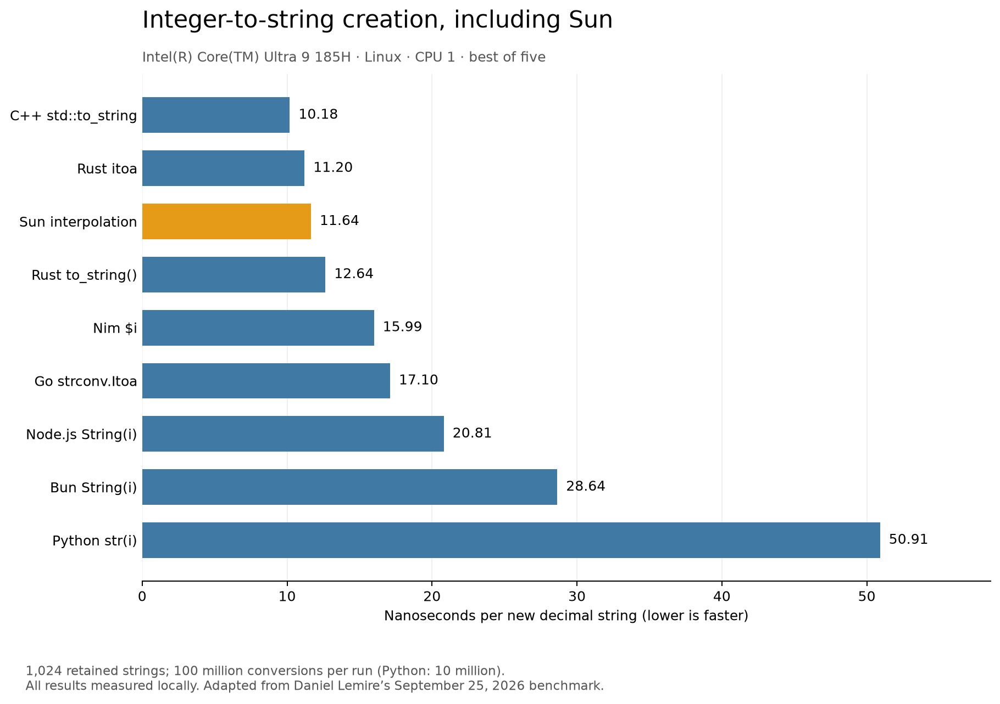

# Current local results: September 25, 2026

Measured after the formatter, LLVM O3 pipeline, and small-string-storage changes.
All languages ran sequentially on CPU 1 of the Intel Core Ultra 9 185H.

| Language | ns/string | Million strings/s |
|---|---:|---:|
| C++ std::to_string | 10.18 | 98.2 |
| Rust itoa | 11.20 | 89.3 |
| Sun interpolation | 11.64 | 85.9 |
| Rust to_string() | 12.64 | 79.1 |
| Nim $i | 15.99 | 62.5 |
| Go strconv.Itoa | 17.10 | 58.5 |
| Node.js String(i) | 20.81 | 48.1 |
| Bun String(i) | 28.64 | 34.9 |
| Python str(i) | 50.91 | 19.6 |

Sun creates 85.9 million strings per second. See the [optimization report](OPTIMIZATION.md)
for changes and validation, [raw output](output.txt), and [versions, commands,
source hashes, and numeric results](results.json).
