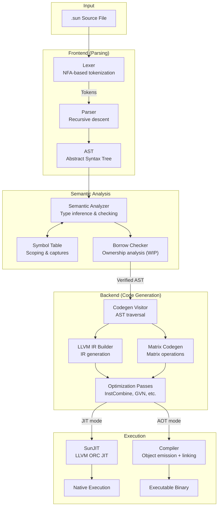

# Architecture

Sun is a compiled language with an LLVM 20 backend.

## Compilation Pipeline

```
Source → Lexer → Parser → AST → Semantic Analyzer → Borrow Checker → Codegen Visitor → LLVM IR → JIT/AOT
```

## Component Overview

| Component | Files | Description |
|-----------|-------|-------------|
| **Driver** | `driver.h/cpp` | Orchestrates the full pipeline: parse → analyze → codegen → execute |
| **Lexer** | `lexer.h/cpp`, `nfa.h` | NFA-based regex tokenizer supporting keywords, operators, literals |
| **Parser** | `parser.h/cpp` | Recursive descent parser producing AST nodes |
| **AST** | `ast.h/cpp` | Expression/statement nodes with type annotations |
| **Semantic Analyzer** | `semantic_analyzer.h/cpp` | Type inference, scope analysis, closure capture detection |
| **Borrow Checker** | `borrow_checker/*.h/cpp` | Rust-style ownership and borrowing analysis (WIP) |
| **Codegen Visitor** | `codegen_visitor.h`, `src/codegen/*.cpp` | Visitor pattern for AST-to-LLVM-IR translation |
| **LLVM Codegen** | `codegen.h/cpp`, `llvm_type_resolver.h/cpp` | LLVM context, module, and type management |
| **Matrix Codegen** | `matrix_codegen.h/cpp` | Specialized code generation for matrix operations |
| **Compiler** | `compiler.h` | AOT compilation: emit object files, link executables |
| **SunJIT** | `sun_jit.h` | LLVM ORC-based JIT compiler for immediate execution |

## Codegen Structure

The code generation is split across multiple files by expression type:

| File | Responsibility |
|------|----------------|
| `codegen_visitor.cpp` | Main visitor dispatch, module initialization |
| `functions_lambdas.cpp` | Function/lambda codegen with closure support |
| `classes.cpp` | Class definitions, constructors, methods |
| `call_expressions.cpp` | Function calls, method calls |
| `variable_creation.cpp` | Variable declarations (`var`, `let`) |
| `variable_references.cpp` | Variable loads, assignments |
| `if_expressions.cpp` | Conditionals, ternary expressions |
| `loops.cpp` | `for` and `while` loops |
| `block_expressions.cpp` | Block scoping |
| `return_statements.cpp` | Return value handling |
| `error_handling.cpp` | `try`/`catch`/`throw` codegen |
| `matrices.cpp` | Matrix operations and indexing |

## Type System

The type system (`types.h`) includes:

- **Primitives**: `i8`, `i16`, `i32`, `i64`, `f32`, `f64`, `bool`, `void`
- **Matrices**: N-dimensional matrices with compile-time or runtime dimensions
- **Functions/Lambdas**: First-class function types with closure support
- **Pointers**: `ptr<T>` owning pointers, `raw_ptr<T>` for C interop, `static_ptr<T>` for static data
- **Classes**: User-defined types with methods and fields
- **Interfaces**: Contracts for polymorphism
- **Generics**: Parameterized types with monomorphization
- **Error Unions**: `T, IError` for explicit error handling

## Execution Modes

### JIT Execution
```bash
sun program.sun
```
Uses LLVM ORC JIT for immediate execution without producing binaries.

### AOT Compilation
```bash
sun --compile -o program program.sun
```
Emits object file via LLVM, links with system C compiler to produce native executable.

## Flow Diagram


