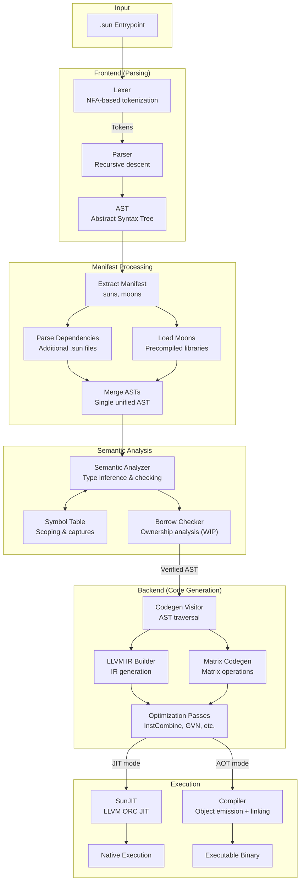

# Architecture

Sun is a compiled language with an LLVM 20 backend.

## Compilation Pipeline

```
Source → Lexer → Parser → AST → Manifest Processing → Merged AST → Semantic Analyzer → Borrow Checker → Codegen Visitor → LLVM IR → JIT/AOT
```

### Pipeline Steps

1. **Lexer** — Tokenize source file
2. **Parser** — Build AST from tokens
3. **Manifest Processing** — Extract manifest, parse additional `suns`, load `moons`
4. **AST Merging** — Combine all parsed ASTs into a single merged AST
5. **Semantic Analysis** — Type inference, scope resolution, capture detection
6. **Borrow Checking** — Ownership and lifetime analysis
7. **Code Generation** — Emit LLVM IR
8. **JIT/AOT** — Execute immediately or compile to native binary

## Component Overview

| Component | Files | Description |
|-----------|-------|-------------|
| **Driver** | `driver.h/cpp` | Orchestrates the full pipeline: parse → analyze → codegen → execute |
| **Lexer** | `lexer.h/cpp`, `nfa.h` | NFA-based regex tokenizer supporting keywords, operators, literals |
| **Parser** | `parser.h/cpp` | Recursive descent parser producing AST nodes |
| **AST** | `ast.h/cpp` | Expression/statement nodes with type annotations |
| **Semantic Analyzer** | `semantic_analyzer.h/cpp` | Type inference, scope analysis, closure capture detection |
| **Borrow Checker** | `borrow_checker/*.h/cpp` | Rust-style ownership and borrowing analysis (WIP) |
| **Codegen Visitor** | `codegen_visitor.h`, `src/codegen/*.cpp` | Visitor pattern for AST-to-LLVM-IR translation |
| **LLVM Codegen** | `codegen.h/cpp`, `llvm_type_resolver.h/cpp` | LLVM context, module, and type management |
| **Compiler** | `compiler.h` | AOT compilation: emit object files, link executables |
| **SunJIT** | `sun_jit.h` | LLVM ORC-based JIT compiler for immediate execution |
| **Moon** | `moon.h/cpp`, `library_cache.h/cpp` | Precompiled library format (.moon) and caching |

## Codegen Structure

The code generation is split across multiple files by expression type:

| File | Responsibility |
|------|----------------|
| `codegen_visitor.cpp` | Main visitor dispatch, module initialization |
| `functions_lambdas.cpp` | Function/lambda codegen with closure support |
| `classes.cpp` | Class definitions, constructors, methods |
| `call_expressions.cpp` | Function calls, method calls |
| `variable_creation.cpp` | Variable declarations (`var`, `let`) |
| `variable_references.cpp` | Variable loads, assignments |
| `if_expressions.cpp` | Conditionals, ternary expressions |
| `loops.cpp` | `for`, `while`, and `for-in` loops |
| `match_expressions.cpp` | Pattern matching (`match` expressions) |
| `block_expressions.cpp` | Block scoping |
| `return_statements.cpp` | Return value handling |
| `error_handling.cpp` | `try`/`catch`/`throw` codegen |
| `arrays.cpp` | Array literals and indexing |
| `pointers.cpp` | Pointer member access (`raw_ptr`, `static_ptr`) |
| `intrinsics.cpp` | Compiler intrinsic codegen (`_sizeof`, `_load`, etc.) |
| `threads.cpp` | OS thread spawning and joining |
| `thread_utils.cpp` | Thread utility helpers |

## Type System

The type system (`types.h`) includes:

- **Primitives**: `i8`, `i16`, `i32`, `i64`, `u8`, `u16`, `u32`, `u64`, `f32`, `f64`, `bool`, `void`
- **Arrays**: Fixed-size arrays with N-dimensional indexing
- **Functions/Lambdas**: First-class function types with closure support
- **Pointers**: `ptr<T>` owning pointers (RAII), `raw_ptr<T>` for C interop, `static_ptr<T>` for static data
- **References**: `ref T` for borrowing without ownership transfer
- **Classes**: User-defined value types with methods and fields
- **Interfaces**: Contracts for polymorphism (including builtin `IIterator`, `IIterable`, `IError`)
- **Enums**: Named integer variants with pattern matching support
- **Generics**: Parameterized types with monomorphization
- **Error Unions**: `T, IError` for explicit error handling
- **Threads**: `Thread<T>` for OS thread handles via `spawn`

## Execution Modes

### JIT Execution
```bash
sun program.sun
```
Uses LLVM ORC JIT for immediate execution without producing binaries.

### AOT Compilation
```bash
sun -c -o program program.sun
```
Emits object file via LLVM, links with system C compiler to produce native executable.

### Debug Mode
```bash
sun --debug program.sun
```
Generates debugging artifacts in `program_debug/`:
- `ast.dot` — GraphViz AST visualization
- `ir.ll` — Full LLVM IR output
- `scope_tree.html` — Semantic scope visualization

## Flow Diagram


