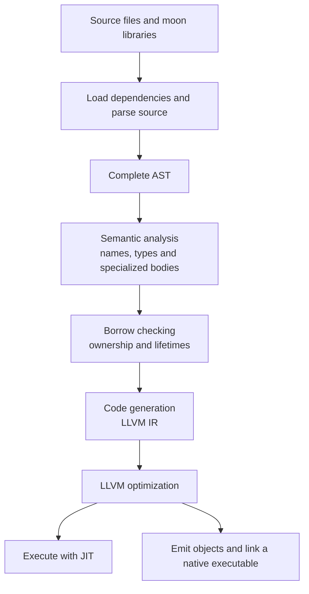

# Architecture

Sun compiles source through a shared analysis pipeline, then uses LLVM to run
the program directly or produce a native executable.

## Compilation flow

```mermaid
flowchart TB
    SOURCE["Source files and moon libraries"]
    FRONTEND["Load dependencies and parse source"]
    AST["Complete AST"]
    SEMANTIC["Semantic analysis<br/>names, types and specialized bodies"]
    BORROW["Borrow checking<br/>ownership and lifetimes"]
    CODEGEN["Code generation<br/>LLVM IR"]
    OPTIMIZE["LLVM optimization"]
    JIT["Execute with JIT"]
    AOT["Emit objects and link a native executable"]

    SOURCE --> FRONTEND --> AST --> SEMANTIC --> BORROW
    BORROW --> CODEGEN --> OPTIMIZE
    OPTIMIZE --> JIT
    OPTIMIZE --> AOT
```

## Stage boundaries

- **Loading and parsing** assemble source and imported declarations into one
  complete abstract syntax tree (AST).
- **Semantic analysis** resolves names and types, checks expressions, and
  prepares concrete generic specializations. Its outputs are an annotated AST
  and shared declaration and type records.
- **Borrow checking** validates ownership and lifetime rules before code is
  emitted.
- **Code generation** uses those checked results to emit LLVM IR. LLVM
  optimization and linking produce the executable form.

These boundaries keep file loading out of semantic analysis and name resolution
out of code generation. JIT and ahead-of-time compilation share the same
frontend and analysis.

## Moon libraries

A moon bundle contains compiled code and metadata describing its declarations.
Importing a bundle makes those declarations available to analysis; generic
templates also retain the syntax needed for new specializations. Stable
declaration identities connect references across independently built bundles.

See [Semantic Analysis](/architecture/semantic-analysis) for the analysis flow
and shared data, and [Code Generation](/architecture/codegen) for how those
results become executable code.
