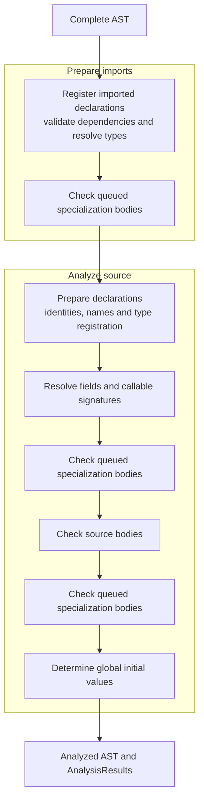
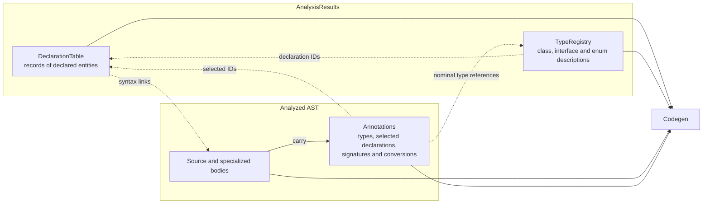
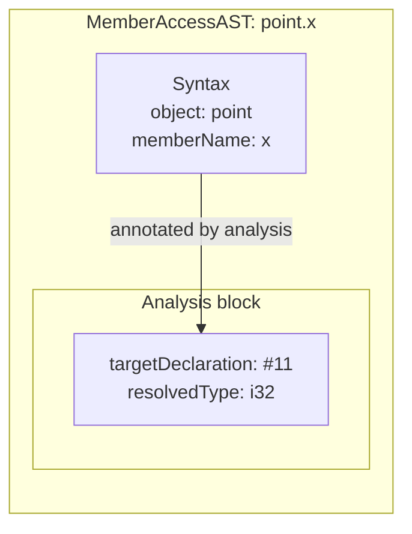
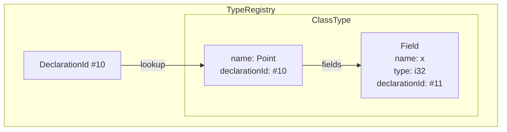
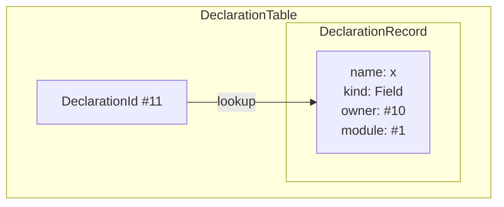

# Semantic Analysis

Semantic analysis gives a parsed program its meaning: it identifies declarations,
resolves types, checks expressions, and prepares generic specializations. It
receives a complete AST and performs no file loading or parsing.

## Analysis flow

Imported bundles are prepared before source declarations. The bundle currently
being built is treated as source.

Registration makes declarations available before their uses are checked.
Imported declaration records are all registered before exact dependencies are
validated, so import order does not determine which declarations can be found.

Body checking resolves references, selects calls, infers expression types, checks
type compatibility, and records captures and conversions. Global initializers
are then classified as values that can be stored in the program image or work
that must run at startup.

## Data shared with codegen

Analysis produces two connected outputs: program-wide records in
`AnalysisResults`, and annotations plus specialized bodies on the AST.

**A type describes the values an expression can have.** The compiler represents
it with a semantic `Type`: an integer type describes its width and signedness;
a class type describes its fields, their types, and its method signatures.
`TypeRegistry` holds the descriptions of declared classes, interfaces and enums,
including concrete generic instances such as `Box<i32>`. Primitive types,
references, arrays and function signatures also have semantic type descriptions,
but are not entries in this registry.

**A declaration introduces an entity into the program**, such as a class,
function, variable or field. `DeclarationTable` gives each one an identity and
records its name, kind, enclosing declaration and module. Where available, the
record also links to its syntax. Two variables can have the same type while
remaining distinct declarations.

**An AST annotation records what analysis learned about a particular piece of
syntax.** A variable reference records which declaration it refers to and its
resolved type. A call records the selected function and any argument conversions.
Codegen reads these decisions when emitting that expression; function and class
bodies remain in the AST, including generated specializations.

### Example: `point.x`

Suppose `point` has type `Point`, with a field `x: i32`. The diagrams show selected
fields using illustrative declaration IDs: `#10` for `Point`, `#11` for `x`, and
`#1` for their module.

**AST node.** Syntax and analysis results live together. The analysis block
records which field was selected and the type of the resulting expression.

**Type registry value.** Looking up the class identity gives its semantic shape.
The field's type describes its values; its declaration ID identifies the field.

**Declaration record.** The same field ID leads to a record describing what was
declared and where it belongs. Its owner is the `Point` class.

A `DeclarationId` connects these structures within one compilation.
`PortableDeclarationKey` provides identity across bundle boundaries. Names
support source lookup; identities distinguish declarations even when names match.

Scopes and the specialization queue are analysis working state. Scopes determine
which names are visible; the queue tracks bodies still needing checks. Codegen
uses the recorded results rather than repeating that work.

## Generics: signatures before bodies

Specialization prepares concrete types and signatures immediately, then queues
the bodies that need checking. For example, `Box<T>.get() T` becomes
`Box<i32>.get() i32`, so a caller knows the result type before the method's
implementation is checked.

Each queue-draining stage checks all pending bodies, including new
specializations requested by those bodies. Repeated requests reuse the same
specialization. Bodies resolve names in their template's definition scope,
preserving its imports and visibility rules.

Recognized compiled specializations reuse their existing implementations.
Abstract shapes containing unresolved type parameters support template checking
but are not emitted as concrete implementations. Named functions without return
annotations use `void`; their return types are not inferred from their bodies.
