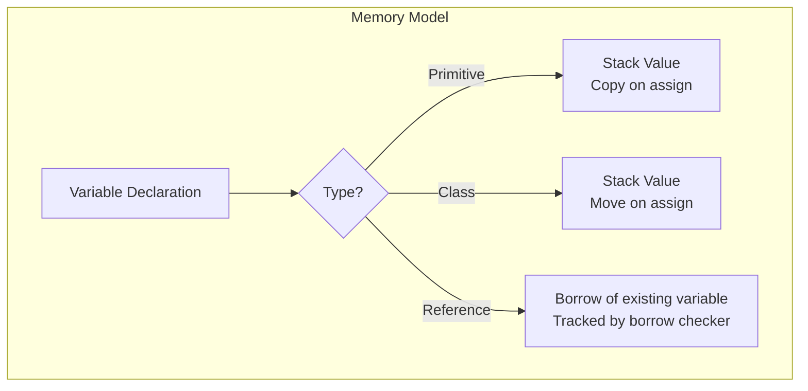
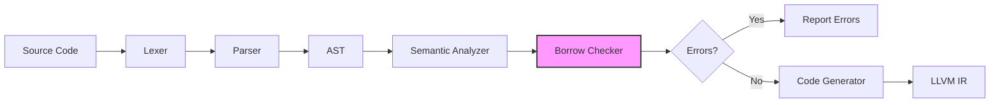
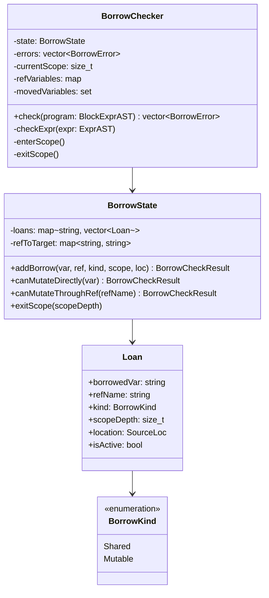
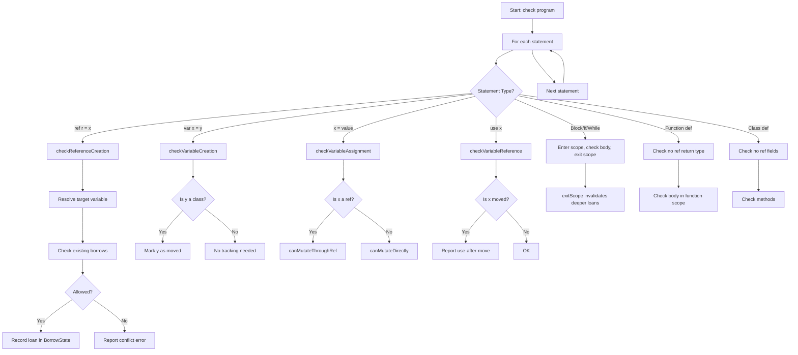
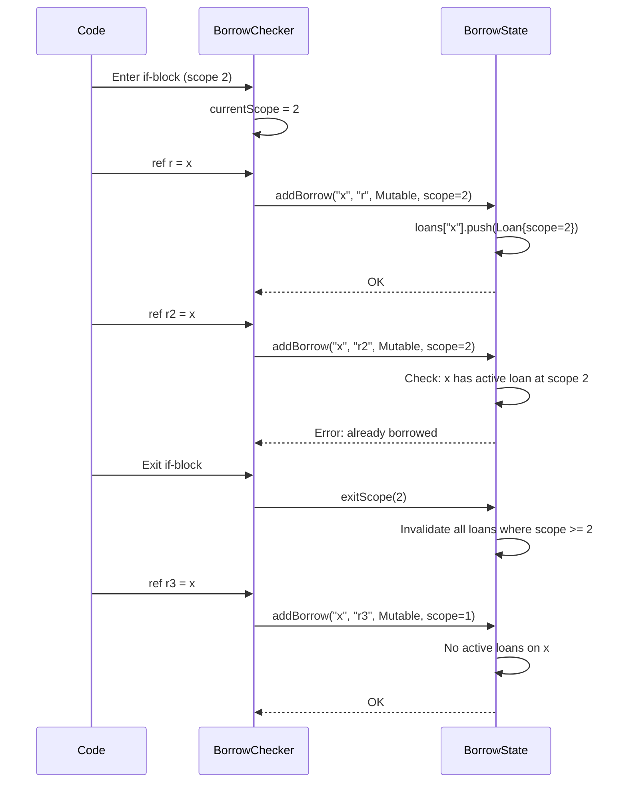
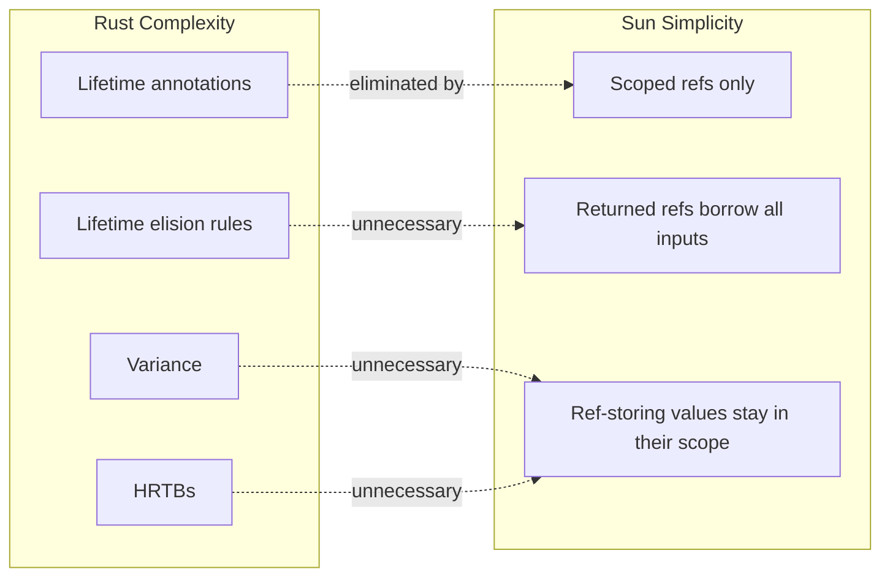

# Memory Safety

Sun implements a **simplified Rust-style ownership system** that provides memory safety guarantees without requiring explicit lifetime annotations. This page covers ownership and moves, references and borrowing, the rules the borrow checker enforces, and the `unsafe` block that steps outside them.

import { Callout } from 'nextra/components'

<Callout type="info">
  Unlike Rust, Sun does not require explicit lifetime annotations (`'a`, `'b`). References are scoped and cannot escape their defining context, which eliminates the need for lifetime tracking.
</Callout>

## Overview

Sun's ownership model is built around three key concepts:

1. **Value Types**: Primitives and classes are value types, allocated on the stack by default
2. **Move Semantics**: Class-typed variables transfer ownership when assigned to another variable
3. **References**: Temporary borrows of variables, tracked by the borrow checker



## Value Types and Move Semantics

### Primitives

Primitive types (`i8`, `i16`, `i32`, `i64`, `u8`, `u16`, `u32`, `u64`, `f32`, `f64`, `bool`) are copied on assignment:

```sun
var x: i32 = 42;
var y: i32 = x;  // y gets a copy of x
x = 100;         // x is now 100, y is still 42
```

### Classes

Classes are **value types** that use **move semantics**. When you assign a class instance to another variable, ownership is transferred and the original variable becomes invalid:

```sun
class Point {
    var x: i32;
    var y: i32;
    
    init(px: i32, py: i32) {
        this.x = px;
        this.y = py;
    }
}

function main() i32 {
    var p1 = Point(3, 4);  // p1 owns the Point
    var p2 = p1;           // Ownership moves to p2
    
    // p1.x;               // ❌ ERROR: use of moved value 'p1'
    return p2.x;           // ✓ OK: p2 now owns the Point
}
```

**Error:**
```
error: use of moved variable 'p1'. Ownership was transferred in a previous assignment.
```

This prevents use-after-move bugs at compile time.

### Writing to a Field

Assigning to a field moves the new value in and drops the value the field held
before, so the old one is released exactly once. A constructor's first write to
a field is the exception: the field has never held a value at that point, so
there is nothing to release and nothing is dropped.

```sun
class Holder {
    var res: Res;

    init() {
        this.res = Res(1);   // starts the field's life — nothing dropped
    }

    method replace(r: Res) void {
        this.res = r;        // replaces what the field holds, dropping it
    }
}
```

In a constructor every write to an owning field has to be one of those two,
and the compiler has to be sure which. A second write is fine when the field
certainly holds a value by then, because what it replaces is known:

```sun
init() {
    this.res = Res(1);   // starts its life
    this.res = Res(2);   // certainly replaces Res(1), which is dropped
}
```

What is rejected is a write the compiler cannot place — where some path
reaching it assigned the field and some did not:

```sun
init(flag: bool) {
    if (flag) { this.res = Res(1); }
    this.res = Res(2);   // ❌ did the branch already assign it?
}
```

Branches are alternatives, so one assignment in each is still one assignment,
and every path arrives in the same state:

```sun
init(flag: bool) {
    if (flag) { this.res = Res(1); } else { this.res = Res(2); }
}
```

A `try` block asks it too: a throw can leave the block part-way through, so a
`catch` clause cannot tell whether the field was assigned before the throw.

A loop is the same question: its body may be the first pass or a later one, so
it needs the field settled before the loop, or the value settled in a local and
assigned once.

```sun
init(n: i32) {
    var chosen = Res(0);
    for (var i: i32 = 1; i < n; i = i + 1) { chosen = Res(i); }
    this.res = chosen;   // one assignment, whatever the loop did
}
```

Only fields that own something are held to this. A field holding a number
releases nothing when it is written again, so accumulating a total in a loop is
fine.

A constructor may still hand the work to its own methods, first values
included: the compiler follows the call into the method's body and what it
assigns counts. A method's write always replaces and drops, whoever calls it.
During construction, before the field's first value, the storage is all zero —
the state a moved-from value is left in, which an owning type's `deinit` has
to treat as "nothing to release" anyway, the way `Unique<T>` checks its
pointer before freeing — so the drop is a no-op there.

What the rules buy is that every write to a field is settled while compiling:
it either starts the field's life and drops nothing, or replaces a value and
drops it. Nothing about a field write is checked at run time.

### Moving on Only Some Paths

A branch can move a value on one path and leave it alone on another. The paths
that did not move it still own it, so it is dropped where they end.

```sun
function maybe(take: bool) void {
    var r = Res(1);
    if (take) { sink(r); }   // moved here, still owned on the other path
}                            // dropped here when `take` was false
```

Either way exactly one owner is left, so `deinit` runs exactly once. After the
`if`, `r` counts as moved whichever way the branch went, so nothing may read it
— see the rule above.

Whether the value was moved depends on the path taken, so the compiler cannot
always answer it while compiling. When it cannot, it puts a flag beside the
value — in the stack frame, never inside the class, so layout is untouched —
that records whether this call still owns it, and the drop reads the flag. Only
values with a genuinely path-dependent move get one: a move on every path, or
on none, stays a decision made while compiling and costs nothing at run time.

See [Constructors](/classes#constructors) for the rule this leans on: every
field is assigned before the object may be used.

### Returning Classes from Functions

Functions can return class instances, transferring ownership to the caller:

```sun
function create_point(x: i32, y: i32) Point {
    return Point(x, y);  // Ownership transfers to caller
}

function main() i32 {
    var p = create_point(5, 10);
    return p.x + p.y;  // Returns 15
}
```

The caller owns the result even when it ignores it. A call used as a
statement (`create_point(1, 2);`) produces a temporary that nobody takes,
and it is dropped — its `deinit` runs — at the end of the enclosing scope,
the same as a discarded constructor temporary.

## Constants

A binding declared with `const` instead of `var` never changes: it cannot be
assigned to (`=`, `+=`), none of its fields or elements can be assigned, no
field can be moved out of it, nothing may take a mutable `ref` to it, and only
[const methods](/classes#const-methods) may be called on it. It can be read,
borrowed with `const ref`, copied if it is a scalar, and — for a local — moved
as a whole, which ends the binding.

```sun
const LIMIT: i32 = 100;           // a constant global

function main() i32 {
    const p = Point(3, 4);
    const n = p.x + LIMIT;        // ✓ reads are fine
    var q = p;                    // ✓ a whole-value move ends `p`
    // p.x = 5;                   // ❌ ERROR: cannot assign to field 'x' of constant 'p'
    // LIMIT = 1;                 // ❌ ERROR: cannot assign to constant 'LIMIT'
    return n;
}
```

A constant global is initialised at runtime like any other global; compile-time
evaluation is on the roadmap. `for (const x: T in c)` makes the loop binding
constant for each element.

## References

References provide temporary, scoped access to variables without transferring ownership. Create a reference using the `ref` keyword:

```sun
function main() i32 {
    var x: i32 = 42;
    ref r = x;      // r references x (mutable borrow)
    r = 100;        // Modifying through r changes x
    return x;       // Returns 100
}
```

References allow you to access and modify variables without copying or moving:

```sun
function increment(x: ref i32) void {
    x = x + 1;
}

function main() i32 {
    var count: i32 = 0;
    increment(count);  // count is now 1
    increment(count);  // count is now 2
    return count;      // Returns 2
}
```

A declaration annotated `ref T` borrows too, which is what lets a borrow carry
an explicit type or come from a call that returns one:

```sun
function main() i32 {
    var p = Point(1, 2);
    var r: ref i32 = p.x;   // borrows the field, same as `ref r = p.x`
    r = 5;
    return p.x;             // Returns 5
}
```

Either form may pick its target with a conditional, as long as both branches
are themselves borrowable. The reference binds whichever slot the condition
selects, and both objects count as borrowed for its lifetime:

```sun
var pick: ref String = h.flag ? h.a : h.b;
```

The target must have storage: a temporary (`var r: ref String = String(alloc,
"x")`) is rejected, since the value it borrows would die at the end of the
statement.

### Constant References

`const ref` borrows a value for reading only. The statement form is
`const ref r = x;`, the type is `const ref T`, and either may bind a
constant, a variable, or a field:

```sun
function total(v: const ref Vec<i32>) i64 {
    return v.size();              // ✓ size() is a const method
    // v.push(1);                 // ❌ ERROR: cannot call non-const method 'push'
}

function main() i32 {
    var x: i32 = 1;
    const ref r = x;              // shared borrow: x may still be read and assigned
    var s: const ref i32 = x;     // same, with an annotation
    // r = 2;                     // ❌ ERROR: cannot assign through const reference 'r'
    return r + s;
}
```

Assigning to `x` while it is shared-borrowed is fine for a scalar like this
one; a borrowed *compound* value cannot be replaced at all — see
[Rule 4](#rule-4-a-borrowed-compound-value-cannot-be-replaced).

Through a `const ref` nothing can be assigned, no mutable `ref` can be taken,
and only const methods can be called. A `ref T` may be passed or rebound as
`const ref T`, never the other way round. When a const method returns a borrow
and the receiver is constant or a `const ref`, the result is the *const view*
of the declared type: `get(i) ref T` yields `const ref T`, and `first()
Option<ref T>` yields `Option<const ref T>`, so a `match` on it binds a
read-only element.

Several `const ref`s to one value may be alive at once; a mutable `ref` cannot
coexist with any of them.

### Reference Rebinding

You can create a reference from another reference. The borrow kind may be downgraded (`ref` to `const ref`) but never upgraded:

```sun
function main() i32 {
    var x: i32 = 10;
    ref r1 = x;       // Mutable borrow of x
    ref r2 = r1;      // ❌ ERROR: x is already borrowed
    const ref r3 = r1;  // ✓ OK: downgrade to a shared borrow
    return x;
}
```

---

## Borrow Checker Architecture

Sun's borrow checker is a compile-time analysis pass that validates reference safety. It runs after semantic analysis and before code generation.



### Core Components

The borrow checker consists of three main components:



| Component | Responsibility |
|-----------|---------------|
| **BorrowChecker** | AST traversal, rule enforcement, error collection |
| **BorrowState** | Tracks active loans per variable, validates borrow requests |
| **Loan** | Represents a single active borrow with metadata |

### Analysis Flow

The borrow checker performs a single pass over the AST:



### Scope Tracking

Borrows are tied to lexical scopes. When a scope exits, all loans created in that scope are invalidated:



---

## Borrow Rules

Sun enforces Rust-style borrow rules at compile time:

### Rule 1: Single Mutable Borrow

At any program point, a variable can have at most **one mutable borrow**:

```sun
function main() i32 {
    var x: i32 = 10;
    ref r1 = x;
    ref r2 = x;  // ❌ ERROR: x is already borrowed
    return r1;
}
```

**Error:**
```
error: cannot borrow 'x' as mutable because it is already borrowed
```

The borrow checker tracks this via the `BorrowState.addBorrow()` method, which checks for conflicting active loans before allowing a new borrow.

### Rule 2: Sequential Borrows Are Allowed

When a reference goes out of scope, the borrow ends. You can then create a new reference:

```sun
function main() i32 {
    var x: i32 = 10;
    
    if (true) {
        ref r1 = x;
        r1 = 20;
    }  // r1 goes out of scope, borrow ends
    
    ref r2 = x;  // ✓ OK: x is no longer borrowed
    r2 = 30;
    return x;    // Returns 30
}
```

This works because `exitScope()` marks loans as inactive when their defining scope ends.

### Rule 3: A Returned Reference Borrows the Call's Inputs

A function may return a reference, but only one that lives in something the
caller passed in — a `ref` parameter, or the receiver of a method. Which
input it points into is not knowable at the call site, so binding the result
to a name conservatively borrows **every** variable the call could hand back
a reference into:

```sun
function longest(a: ref String, b: ref String) ref String {
    if (a.length() > b.length()) { return a; } else { return b; }
}

function main() void {
    var a: String = `.`;
    var b: String = `..`;
    var c: ref String = longest(a, b);  // both a and b are borrowed
    // a = `x`;                         // ❌ ERROR: 'a' is borrowed
    // b = `y`;                         // ❌ ERROR: 'b' is borrowed
    c = `z`;                            // ✓ replaces whichever c points at
    println(c);
}
```

The same applies to container accessors: `var e: ref T = vec.get(i)` borrows
`vec` until `e` goes out of scope. When you only need the value of a scalar
element, annotate the scalar type instead — `var e: i32 = vec.get(i)` copies
it out and takes no borrow.

### Rule 4: A Borrowed Compound Value Cannot Be Replaced

Assigning a new value to a class, payload enum, or interface variable drops
the old value — including the storage every live borrow points into. So while
such a variable is borrowed, assigning to it is rejected; assign **through**
the borrow instead, which correctly drops the old referent and moves the new
value in:

```sun
function main() void {
    var b: String = `..`;
    var c: ref String = b;
    // b = `new`;    // ❌ ERROR: cannot assign to 'b' because it is borrowed
    c = `new`;       // ✓ replaces b through the borrow
}
```

Scalars are different: overwriting an `i32` leaves its storage in place, so
assigning to a borrowed scalar stays legal and live borrows simply observe
the new value:

```sun
function main() i32 {
    var x: i32 = 10;
    ref r = x;
    x = 20;      // ✓ scalar write; nothing is dropped
    return r;    // Returns 20
}
```

### Rule 5: A Class That Stores References Is Itself a Borrow

A class may have reference-type fields. Such a value points into storage it
does not own, so it is treated like a borrow: constructing it takes a loan on
every variable passed by ref to the constructor, and those loans last until
the enclosing scope ends.

```sun
class Holder {
    public var x: ref String;
    init(x: ref String) { this.x = x; }
}

function main() void {
    var a: String = `a`;
    var b: String = `b`;
    var t = Holder(a);   // t stores a ref into a: a is borrowed
    // b = a;            // ❌ ERROR: cannot move out of 'a' because it is borrowed
    // ref r = a;        // ❌ ERROR: 'a' is already borrowed
    println(t.x);        // ✓ reads through the stored ref
}
```

And like a lambda with a capture list, such a value cannot leave the frame
that built it — what its refs point into dies when the function returns:

```sun
function make() Holder {
    var a: String = `dies here`;
    return Holder(a);   // ❌ ERROR: cannot return a value that stores references
}
```

This holds transitively: a class whose field is (or contains) a ref-storing
class is subject to the same rules.

### Rule 6: Use-After-Move Detection

When a class-typed variable is assigned to another variable, the original is marked as moved and cannot be used:

```sun
function main() i32 {
    var p1 = Point(1, 2);
    var p2 = p1;          // p1 is moved
    
    return p1.x;          // ❌ ERROR: use of moved variable
}
```

**Error:**
```
error: use of moved variable 'p1'. Ownership was transferred in a previous assignment.
```

A lambda's capture list is another place a value moves. An entry that says
`ref` borrows — `[ref x]` mutably, `[const ref x]` read-only — and an entry
that says neither gives the value to the closure:

```sun
function main() i32 {
    var p = Point(1, 2);
    var f = lambda [p] () i32 { return p.x; };   // p moves into the closure

    return p.x;           // ❌ ERROR: use of moved variable
}
```

The closure owns what it took, so it may change it, and it is dropped when the
closure's scope ends. A scalar has nothing to move, so `[x]` copies it. A
compound value is never picked up implicitly: a lambda that uses one without
naming it in the capture list is rejected, so you have to say which of the
three you meant.

---

## Scope-Based Borrowing

Borrows are automatically invalidated when the reference goes out of scope:

```sun
function main() i32 {
    var x: i32 = 10;
    
    if (condition) {
        ref r = x;    // Borrow starts (scope depth increases)
        r = 20;
    }                 // Borrow ends (scope depth decreases)
    
    x = 30;           // ✓ OK: x is no longer borrowed
    return x;
}
```

This works naturally with loops - each iteration creates a fresh borrow:

```sun
function main() i32 {
    var sum: i32 = 0;
    var i: i32 = 0;
    
    while (i < 5) {
        ref r = sum;  // New borrow each iteration
        r = r + i;
        i = i + 1;
    }                 // Borrow ends each iteration
    
    return sum;       // Returns 10 (0+1+2+3+4)
}
```

---

## Passing References to Functions

References can be passed to functions that accept `ref` parameters:

```sun
function swap(a: ref i32, b: ref i32) void {
    var temp: i32 = a;
    a = b;
    b = temp;
}

function main() i32 {
    var x: i32 = 1;
    var y: i32 = 2;
    swap(x, y);
    // x is now 2, y is now 1
    return x;
}
```

<Callout type="info">
  When you pass a variable to a function expecting a `ref` parameter, the borrow lasts only for the duration of the function call.
</Callout>

---

## Unsafe Blocks

A few operations sit outside what any of this can prove — calling into C,
reading through a raw pointer, touching a word atomically. Sun does not forbid
them; it asks you to write them inside an `unsafe` block, so the places where
the compiler stopped proving things are visible in the source.

An `unsafe` block is an **expression**, so it appears in both of the places an
expression can, and **every statement inside the braces keeps its own
semicolon**. This is the part that is easy to get wrong:

```sun
unsafe { _free(mem); };            // statement: ends the call, then the statement
var mem = unsafe { _malloc(n); };  // value: the block is the last expression
var mem = unsafe { _malloc(n) };   // ❌ ERROR: expected ';' after expression statement
```

A block may hold several statements; the last one is its value. Names declared
inside stay inside, like any other block body — but the value leaves, and
ownership of it leaves too, so `var s = unsafe { make(); };` keeps its string.

A `return` inside the block returns from the enclosing **function** — there is
no block-local return — which is what makes `unsafe { return c_abs(x); };` the
usual way to wrap a C call. It also means a block that always leaves the
function never produces a value, so binding one is rejected:

```sun
var x = unsafe { return 0; };   // ❌ ERROR: the block never produces a value
var y = unsafe {
    if (tooBig) { return 0; }   // ✓ conditional early exit; y binds otherwise
    c_abs(n);
};
```

### What requires a block

Three things:

- **Calling an `extern "C"` function.** C is outside everything Sun proves.
  See [C FFI](/c-ffi).
- **Reading a field through a `raw_ptr<T>`** where `T` is a class. Nothing says
  the pointer is non-null, aligned, or still pointing at a live `T`.
- **An intrinsic that reads or writes memory nothing has checked** — through a
  raw pointer (`_load<T>`, `_store<T>`, `_to_ref<T>`, `_init<T>`, `_deinit<T>`,
  `_load_i64`, `_store_i64`, `_memcpy`, `_memset`, `_ptr_offset`), on the heap
  (`_malloc`, `_free`), across threads (`_spawn`, `_thread_join*`, the
  `_atomic_*` and `_futex_*` intrinsics), or across the boundary into libc and
  the kernel (every `__`-prefixed file and socket intrinsic).

An intrinsic that only *computes* needs no block: `_sizeof<T>`, `_is<T>`,
`_address_of<T>`, `_ptr_as_raw<T>`, `_convert<T>`, `_bitcast<T>`,
`_target_is`, the print intrinsics and the bit intrinsics. Taking an address is
safe; reading through it is not. See [Compiler Intrinsics](/intrinsics).

### What it does not turn off

`unsafe` is a narrow permission, not a mode. **The borrow checker still runs**,
values still move rather than copy, and type checking, visibility and constness
are unchanged:

```sun
var b = Box(1);
unsafe {
    var r: ref Box = b;
    var r2: ref Box = b;   // ❌ ERROR: cannot borrow 'b' as mutable
};                         //    because it is already borrowed
```

It is also lexical: calling a safe Sun function from inside a block does not
make that function's body unsafe — which is the point of a safe wrapper. A
lambda body is checked on its own, so the block goes inside the lambda:

```sun
var g = lambda(x: i32) i32 { return unsafe { c_abs(x); }; };
```

The useful pattern is to keep `unsafe` small and behind a safe signature, so
callers get a checked API and there is one place to audit. That is how the
standard library is built: `Vec<T>`, `String` and `Unique<T>` are safe types
whose bodies hold the raw loads and stores. A safe wrapper is a claim, and the
claim is yours — the compiler checks that the block is there, not that what is
inside it is correct.

---

## How the Borrow Checker Works Internally

### 1. Loan Creation

When `ref r = x` is encountered:

1. **Resolve target**: If `x` is itself a reference, follow the chain to find the actual borrowed variable
2. **Check conflicts**: Query `BorrowState` for active loans on the target variable
3. **Record loan**: If allowed, create a `Loan` record with the current scope depth

```cpp
// Simplified from borrow_state.cpp
BorrowCheckResult BorrowState::addBorrow(const std::string& borrowedVar,
                                         const std::string& refName,
                                         BorrowKind kind,
                                         size_t scopeDepth,
                                         const SourceLoc& loc) {
  auto& varLoans = loans_[borrowedVar];
  
  // Check existing borrows
  for (const auto& loan : varLoans) {
    if (!loan.isActive) continue;
    
    if (kind == BorrowKind::Mutable) {
      // Mutable borrow requires no existing borrows
      return BorrowCheckResult::error(
          "cannot borrow '" + borrowedVar + "' as mutable because it is already borrowed",
          loan);
    }
  }
  
  // Create the loan
  varLoans.push_back(Loan(borrowedVar, refName, kind, scopeDepth, loc));
  return BorrowCheckResult::ok();
}
```

### 2. Scope Exit

When leaving a scope (e.g., end of `if` block, loop iteration, function):

```cpp
void BorrowState::exitScope(size_t scopeDepth) {
  for (auto& [var, varLoans] : loans_) {
    for (auto& loan : varLoans) {
      if (loan.isActive && loan.scopeDepth >= scopeDepth) {
        loan.isActive = false;  // Invalidate the loan
      }
    }
  }
}
```

### 3. Move Tracking

When assigning a class-typed variable:

```cpp
void BorrowChecker::checkVariableCreation(const VariableCreationAST& var) {
  if (var.get_value() && 
      var.get_value()->getType() == ASTNodeType::VARIABLE_REFERENCE) {
    const auto& srcRef = static_cast<const VariableReferenceAST&>(*var.get_value());
    auto srcType = var.get_value()->getResolvedType();
    
    if (srcType && srcType->isClass()) {
      movedVariables_.insert(srcRef.getName());  // Mark as moved
    }
  }
}
```

---

## Comparison with Rust

| Feature | Rust | Sun |
|---------|------|-----|
| Explicit lifetimes | Required for complex cases | Never needed |
| References in structs | Yes (with lifetimes) | Yes (object borrows its inputs) |
| Return references | Yes (with lifetimes) | Yes (borrows all by-ref inputs) |
| Mutable borrow exclusivity | Enforced | Enforced |
| Shared borrows (`&T`) | Yes | Yes (`const ref T`) |
| Move semantics | Yes | Yes (for classes) |
| Use-after-move detection | Yes | Yes |
| Learning curve | Steep | Moderate |

---

## Why These Restrictions?

Sun's borrow checker is intentionally simpler than Rust's:

1. **No lifetime annotations** means easier learning curve and cleaner syntax
2. **Scoped borrows only** eliminates dangling reference bugs
3. **Returned refs borrow every by-ref input** so no lifetime tracking is
   needed across function boundaries
4. **Ref-storing classes are borrows** - they lock their inputs for the scope
   and cannot escape it, so no struct lifetime analysis is needed



These restrictions handle ~80% of common use cases while being significantly easier to understand than full lifetime tracking.

---

## Best Practices

### Do: Use References for In-Place Modification

```sun
function double_array(arr: ref matrix<i32, 10>) void {
    for (var i: i32 = 0; i < 10; i = i + 1) {
        arr[i] = arr[i] * 2;
    }
}
```

### Do: Keep Borrows Short-Lived

```sun
function process(data: ref i32) void {
    // Use data immediately
    var result = data * 2;
    // Don't hold onto the reference longer than needed
}
```

### Do: Use Scopes to Control Borrow Lifetime

```sun
function main() i32 {
    var x: i32 = 0;
    
    // Scope limits the borrow
    if (true) {
        ref r = x;
        r = 42;
    }
    
    // x is free to use again
    return x;
}
```

### Don't: Store References When a Value Will Do

A class with ref fields borrows whatever it was built from, which locks
those variables for the object's whole scope and keeps the object from being
returned. Store the value unless you really want a view:

```sun
// Locks its constructor argument for the scope, cannot be returned
class Cache {
    var cached: ref i32;
}

// ✓ Owns its data, moves freely
class Cache {
    var cached: i32;
}
```

### Don't: Use Variables After Moving

```sun
// ❌ This won't compile
function main() i32 {
    var p1 = Point(1, 2);
    var p2 = p1;
    return p1.x;  // Error: p1 was moved
}

// ✓ Use the new owner
function main() i32 {
    var p1 = Point(1, 2);
    var p2 = p1;
    return p2.x;  // OK: p2 owns the value
}
```
