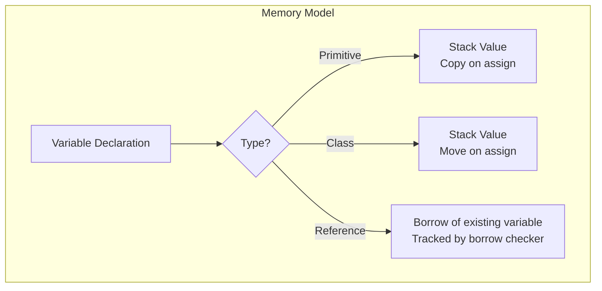
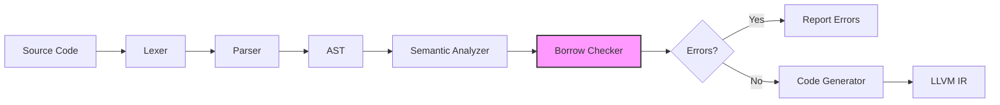
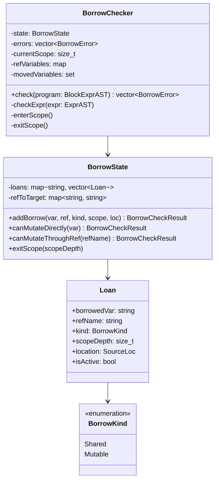
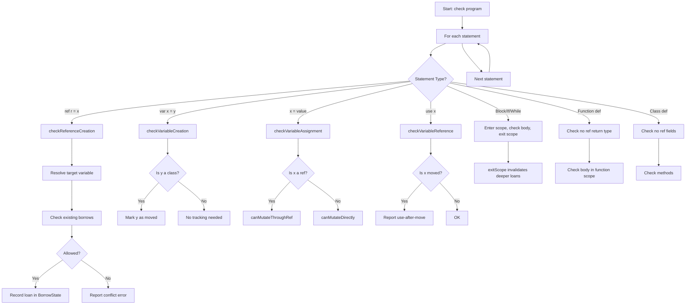
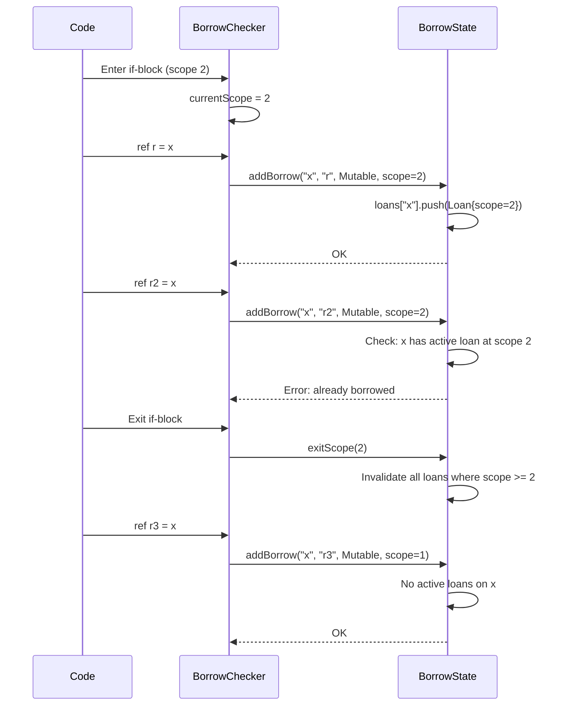
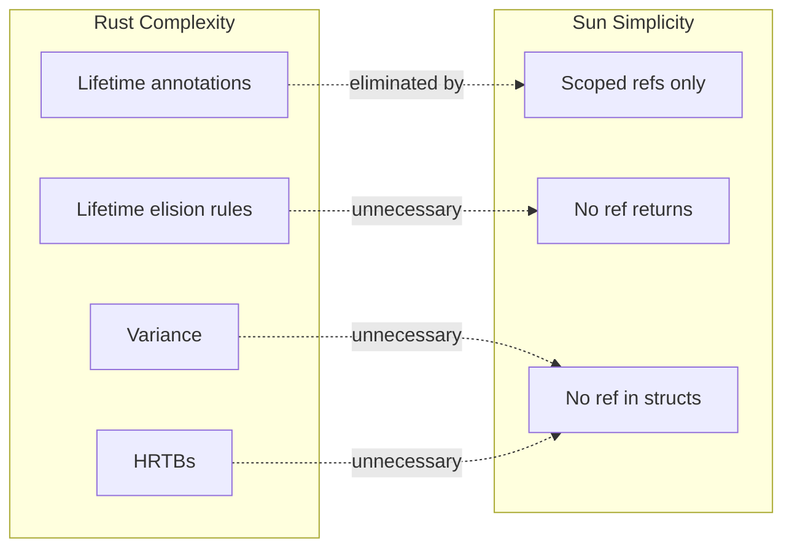

# Ownership and Borrowing

Sun implements a **simplified Rust-style ownership system** that provides memory safety guarantees without requiring explicit lifetime annotations.

import { Callout } from 'nextra/components'

<Callout type="info">
  Unlike Rust, Sun does not require explicit lifetime annotations (`'a`, `'b`). References are scoped and cannot escape their defining context, which eliminates the need for lifetime tracking.
</Callout>

## Overview

Sun's ownership model is built around three key concepts:

1. **Value Types**: Primitives and classes are value types, allocated on the stack by default
2. **Move Semantics**: Class-typed variables transfer ownership when assigned to another variable
3. **References**: Temporary borrows of variables, tracked by the borrow checker



## Value Types and Move Semantics

### Primitives

Primitive types (`i8`, `i16`, `i32`, `i64`, `u8`, `u16`, `u32`, `u64`, `f32`, `f64`, `bool`) are copied on assignment:

```sun
var x: i32 = 42;
var y: i32 = x;  // y gets a copy of x
x = 100;         // x is now 100, y is still 42
```

### Classes

Classes are **value types** that use **move semantics**. When you assign a class instance to another variable, ownership is transferred and the original variable becomes invalid:

```sun
class Point {
    var x: i32;
    var y: i32;
    
    function init(px: i32, py: i32) {
        this.x = px;
        this.y = py;
    }
}

function main() i32 {
    var p1 = Point(3, 4);  // p1 owns the Point
    var p2 = p1;           // Ownership moves to p2
    
    // p1.x;               // ❌ ERROR: use of moved value 'p1'
    return p2.x;           // ✓ OK: p2 now owns the Point
}
```

**Error:**
```
error: use of moved variable 'p1'. Ownership was transferred in a previous assignment.
```

This prevents use-after-move bugs at compile time.

### Returning Classes from Functions

Functions can return class instances, transferring ownership to the caller:

```sun
function create_point(x: i32, y: i32) Point {
    return Point(x, y);  // Ownership transfers to caller
}

function main() i32 {
    var p = create_point(5, 10);
    return p.x + p.y;  // Returns 15
}
```

## References

References provide temporary, scoped access to variables without transferring ownership. Create a reference using the `ref` keyword:

```sun
function main() i32 {
    var x: i32 = 42;
    ref r = x;      // r references x (mutable borrow)
    r = 100;        // Modifying through r changes x
    return x;       // Returns 100
}
```

References allow you to access and modify variables without copying or moving:

```sun
function increment(x: ref i32) {
    x = x + 1;
}

function main() i32 {
    var count: i32 = 0;
    increment(count);  // count is now 1
    increment(count);  // count is now 2
    return count;      // Returns 2
}
```

### Reference Rebinding

You can create a reference from another reference. The borrow kind may be downgraded but never upgraded:

```sun
function main() i32 {
    var x: i32 = 10;
    ref r1 = x;       // Mutable borrow of x
    ref r2 = r1;      // ❌ ERROR: x is already borrowed
    return x;
}
```

---

## Borrow Checker Architecture

Sun's borrow checker is a compile-time analysis pass that validates reference safety. It runs after semantic analysis and before code generation.



### Core Components

The borrow checker consists of three main components:



| Component | Responsibility |
|-----------|---------------|
| **BorrowChecker** | AST traversal, rule enforcement, error collection |
| **BorrowState** | Tracks active loans per variable, validates borrow requests |
| **Loan** | Represents a single active borrow with metadata |

### Analysis Flow

The borrow checker performs a single pass over the AST:



### Scope Tracking

Borrows are tied to lexical scopes. When a scope exits, all loans created in that scope are invalidated:



---

## Borrow Rules

Sun enforces Rust-style borrow rules at compile time:

### Rule 1: Single Mutable Borrow

At any program point, a variable can have at most **one mutable borrow**:

```sun
function main() i32 {
    var x: i32 = 10;
    ref r1 = x;
    ref r2 = x;  // ❌ ERROR: x is already borrowed
    return r1;
}
```

**Error:**
```
error: cannot borrow 'x' as mutable because it is already borrowed
```

The borrow checker tracks this via the `BorrowState.addBorrow()` method, which checks for conflicting active loans before allowing a new borrow.

### Rule 2: Sequential Borrows Are Allowed

When a reference goes out of scope, the borrow ends. You can then create a new reference:

```sun
function main() i32 {
    var x: i32 = 10;
    
    if (true) {
        ref r1 = x;
        r1 = 20;
    }  // r1 goes out of scope, borrow ends
    
    ref r2 = x;  // ✓ OK: x is no longer borrowed
    r2 = 30;
    return x;    // Returns 30
}
```

This works because `exitScope()` marks loans as inactive when their defining scope ends.

### Rule 3: References Cannot Be Returned

Functions cannot return reference types. This eliminates the need for lifetime annotations:

```sun
// ❌ ERROR: Cannot return a reference
function getRef(x: ref i32) ref i32 {
    return x;
}

// ✓ OK: Return the value (it gets copied)
function getValue(x: ref i32) i32 {
    return x;  // Returns the dereferenced value
}
```

<Callout type="warning">
  Attempting to declare a function with a `ref` return type will result in a compile error: "function cannot return a reference type"
</Callout>

### Rule 4: No References in Classes

Classes cannot have reference-type fields:

```sun
// ❌ ERROR: Cannot store reference in class
class Container {
    var r: ref i32;
}

// ✓ OK: Store values, not references
class Container {
    var value: i32;
}
```

**Error:**
```
error: class 'Container' cannot have reference field 'r' - references cannot be stored in structs
```

### Rule 5: Use-After-Move Detection

When a class-typed variable is assigned to another variable, the original is marked as moved and cannot be used:

```sun
function main() i32 {
    var p1 = Point(1, 2);
    var p2 = p1;          // p1 is moved
    
    return p1.x;          // ❌ ERROR: use of moved variable
}
```

**Error:**
```
error: use of moved variable 'p1'. Ownership was transferred in a previous assignment.
```

---

## Scope-Based Borrowing

Borrows are automatically invalidated when the reference goes out of scope:

```sun
function main() i32 {
    var x: i32 = 10;
    
    if (condition) {
        ref r = x;    // Borrow starts (scope depth increases)
        r = 20;
    }                 // Borrow ends (scope depth decreases)
    
    x = 30;           // ✓ OK: x is no longer borrowed
    return x;
}
```

This works naturally with loops - each iteration creates a fresh borrow:

```sun
function main() i32 {
    var sum: i32 = 0;
    var i: i32 = 0;
    
    while (i < 5) {
        ref r = sum;  // New borrow each iteration
        r = r + i;
        i = i + 1;
    }                 // Borrow ends each iteration
    
    return sum;       // Returns 10 (0+1+2+3+4)
}
```

---

## Passing References to Functions

References can be passed to functions that accept `ref` parameters:

```sun
function swap(a: ref i32, b: ref i32) {
    var temp: i32 = a;
    a = b;
    b = temp;
}

function main() i32 {
    var x: i32 = 1;
    var y: i32 = 2;
    swap(x, y);
    // x is now 2, y is now 1
    return x;
}
```

<Callout type="info">
  When you pass a variable to a function expecting a `ref` parameter, the borrow lasts only for the duration of the function call.
</Callout>

---

## How the Borrow Checker Works Internally

### 1. Loan Creation

When `ref r = x` is encountered:

1. **Resolve target**: If `x` is itself a reference, follow the chain to find the actual borrowed variable
2. **Check conflicts**: Query `BorrowState` for active loans on the target variable
3. **Record loan**: If allowed, create a `Loan` record with the current scope depth

```cpp
// Simplified from borrow_state.cpp
BorrowCheckResult BorrowState::addBorrow(const std::string& borrowedVar,
                                         const std::string& refName,
                                         BorrowKind kind,
                                         size_t scopeDepth,
                                         const SourceLoc& loc) {
  auto& varLoans = loans_[borrowedVar];
  
  // Check existing borrows
  for (const auto& loan : varLoans) {
    if (!loan.isActive) continue;
    
    if (kind == BorrowKind::Mutable) {
      // Mutable borrow requires no existing borrows
      return BorrowCheckResult::error(
          "cannot borrow '" + borrowedVar + "' as mutable because it is already borrowed",
          loan);
    }
  }
  
  // Create the loan
  varLoans.push_back(Loan(borrowedVar, refName, kind, scopeDepth, loc));
  return BorrowCheckResult::ok();
}
```

### 2. Scope Exit

When leaving a scope (e.g., end of `if` block, loop iteration, function):

```cpp
void BorrowState::exitScope(size_t scopeDepth) {
  for (auto& [var, varLoans] : loans_) {
    for (auto& loan : varLoans) {
      if (loan.isActive && loan.scopeDepth >= scopeDepth) {
        loan.isActive = false;  // Invalidate the loan
      }
    }
  }
}
```

### 3. Move Tracking

When assigning a class-typed variable:

```cpp
void BorrowChecker::checkVariableCreation(const VariableCreationAST& var) {
  if (var.getValue() && 
      var.getValue()->getType() == ASTNodeType::VARIABLE_REFERENCE) {
    const auto& srcRef = static_cast<const VariableReferenceAST&>(*var.getValue());
    auto srcType = var.getValue()->getResolvedType();
    
    if (srcType && srcType->isClass()) {
      movedVariables_.insert(srcRef.getName());  // Mark as moved
    }
  }
}
```

---

## Comparison with Rust

| Feature | Rust | Sun |
|---------|------|-----|
| Explicit lifetimes | Required for complex cases | Never needed |
| References in structs | Yes (with lifetimes) | No |
| Return references | Yes (with lifetimes) | No |
| Mutable borrow exclusivity | Enforced | Enforced |
| Shared borrows (`&T`) | Yes | Planned |
| Move semantics | Yes | Yes (for classes) |
| Use-after-move detection | Yes | Yes |
| Learning curve | Steep | Moderate |

---

## Why These Restrictions?

Sun's borrow checker is intentionally simpler than Rust's:

1. **No lifetime annotations** means easier learning curve and cleaner syntax
2. **Scoped borrows only** eliminates dangling reference bugs
3. **No ref returns** prevents use-after-free at function boundaries
4. **No ref fields** avoids complex struct lifetime analysis



These restrictions handle ~80% of common use cases while being significantly easier to understand than full lifetime tracking.

---

## Best Practices

### Do: Use References for In-Place Modification

```sun
function double_array(arr: ref matrix<i32, 10>) {
    for (var i: i32 = 0; i < 10; i = i + 1) {
        arr[i] = arr[i] * 2;
    }
}
```

### Do: Keep Borrows Short-Lived

```sun
function process(data: ref i32) {
    // Use data immediately
    var result = data * 2;
    // Don't hold onto the reference longer than needed
}
```

### Do: Use Scopes to Control Borrow Lifetime

```sun
function main() i32 {
    var x: i32 = 0;
    
    // Scope limits the borrow
    if (true) {
        ref r = x;
        r = 42;
    }
    
    // x is free to use again
    return x;
}
```

### Don't: Try to Store References

```sun
// ❌ This won't compile
class Cache {
    var cached: ref i32;  // Error: refs can't be stored
}

// ✓ Store values instead
class Cache {
    var cached: i32;
}
```

### Don't: Use Variables After Moving

```sun
// ❌ This won't compile
function main() i32 {
    var p1 = Point(1, 2);
    var p2 = p1;
    return p1.x;  // Error: p1 was moved
}

// ✓ Use the new owner
function main() i32 {
    var p1 = Point(1, 2);
    var p2 = p1;
    return p2.x;  // OK: p2 owns the value
}
```
