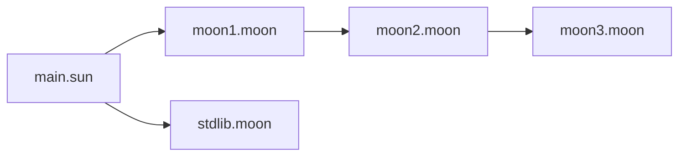

# Modules & Transitive Moons

Sun compiles reusable libraries into `.moon` files. Dependencies are transitive
at the bitcode level but opaque at the symbol level: `main` sees `moon1`, but not
the `moon2`/`moon3` symbols that `moon1` pulls in. The chain
`main -> moon1 -> moon2 -> moon3` computes `1 + 2 + 3 = 6`.



The compiled `moon1.moon` file contains the bitcode of `moon2` and `moon3`.

```bash
./build.sh
./main
```
